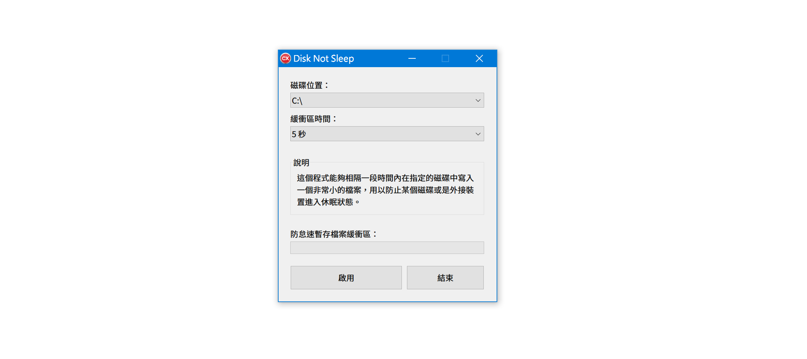
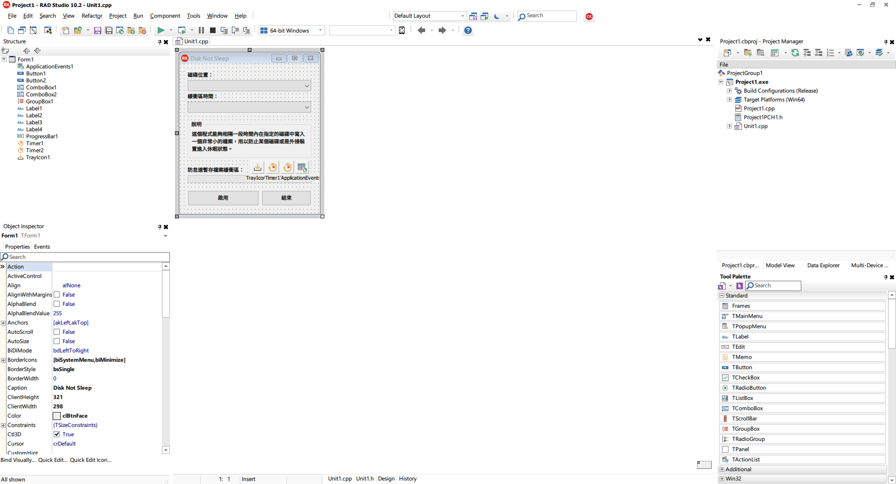
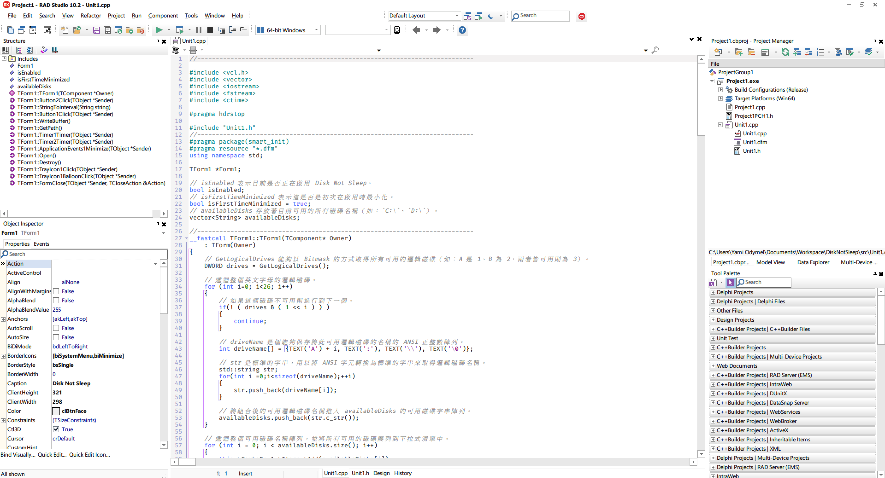

# Disk Not Sleep



有時候硬碟爬代會在一定時間內進入休眠狀態，而需要存取檔案時又需要等待該硬碟重新喚醒，導致整個 Windows 檔案瀏覽器當機無回應。這個時候 Disk Not Sleep 能夠指定一個磁碟，並且在指定時間內讀寫某個檔案（內容為簡單的 Unix 時間戳，約 1 KB），並且防止該磁碟進入休眠。

## 如何使用

此應用程式為 Windows 64 位元系統專用，下載此專案並且開啟 `bin/Win64/Project1.exe` 即可。

## 專案編輯

此輔助程式由 C++ Builder 10.2.3 Tokyo 寫成，開啟 `src/Project1.cbproj` 即可以 C++ Builder 開啟整個專案進行開發。





## 原始碼

若以其他編輯器開啟並檢視 C++ 原始碼，請參閱 `src/Unit1.cpp` 檔案，該檔案擁有完整的註釋。

```cpp
TForm1 *Form1;

// isEnabled 表示目前是否正在啟用 Disk Not Sleep。
bool isEnabled;
// isFirstTimeMinimized 表示這是否是初次在啟用時最小化。
bool isFirstTimeMinimized = true;
// availableDisks 存放著目前可用的所有磁碟名稱（如：`C:\`、`D:\`）。
vector<String> availableDisks;

//---------------------------------------------------------------------------
__fastcall TForm1::TForm1(TComponent* Owner)
	: TForm(Owner)
{
	// GetLogicalDrives 能夠以 Bitmask 的方式取得所有可用的邏輯磁碟（如：A 是 1、B 為 2，兩者皆可用則為 3）。
	DWORD drives = GetLogicalDrives();

	// 遞迴整個英文字母的邏輯磁碟。
	for (int i=0; i<26; i++)
	{
		// 如果這個磁碟不可用則進行到下一個。
		if(! ( drives & ( 1 << i ) ) )
		{
			continue;
		}

		// driveName 是個能夠保存將此可用邏輯磁碟的名稱的 ANSI 正整數陣列。
		int driveName[] = {TEXT('A') + i, TEXT(':'), TEXT('\\'), TEXT('\0')};

		// str 是標準的字串，用以將 ANSI 字元轉換為標準的字串來取得邏輯磁碟名稱。
		std::string str;
		for(int i =0;i<sizeof(driveName);++i)

    // ... 以下隱藏 ...
```